Credit Easing Policy Tools
==========================

[Now on CRAN](http://cran.r-project.org/web/packages/easingr/index.html).

The R package ```easingr``` provides convenient access to the Credit Easing Policy Tools data provided by the Federal Reserve Bank of Cleveland.  The package provides data download functions and some representative plots along the same categories as provided by the bank. See the [FRB's terms of use](http://www.clevelandfed.org/utilities/terms_of_use.cfm?DCS.nav=Footer) regarding these data.   

As a simple example of gathering data and drawing simple plots consider the R code
```{r}
require(easingr)
require(lattice)
dt <- getEasingDetails()
xyplot(dt)
easingLineChart(dt)
```

Several examples of plots are shown by category below.  For details on each query and more example plots, please see the package vignette.  

Summary Report
--------------

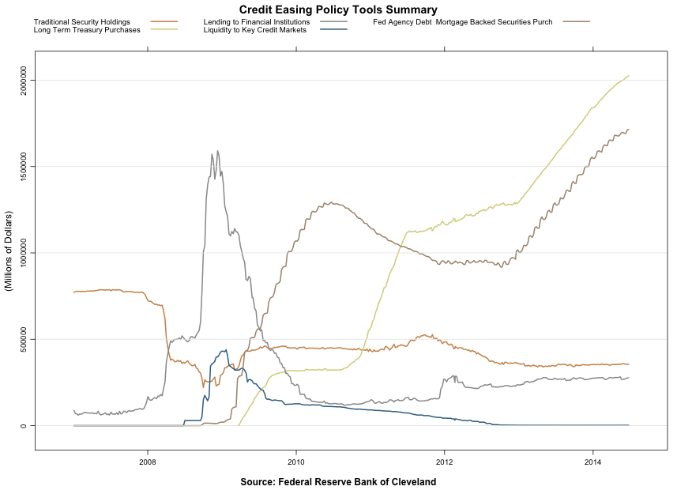


Details Report
--------------
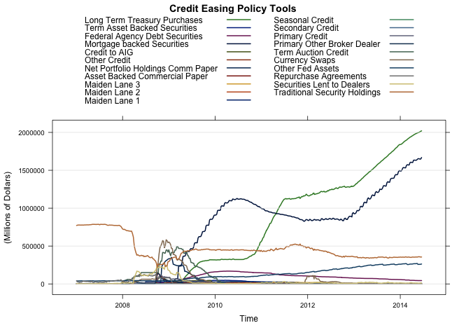
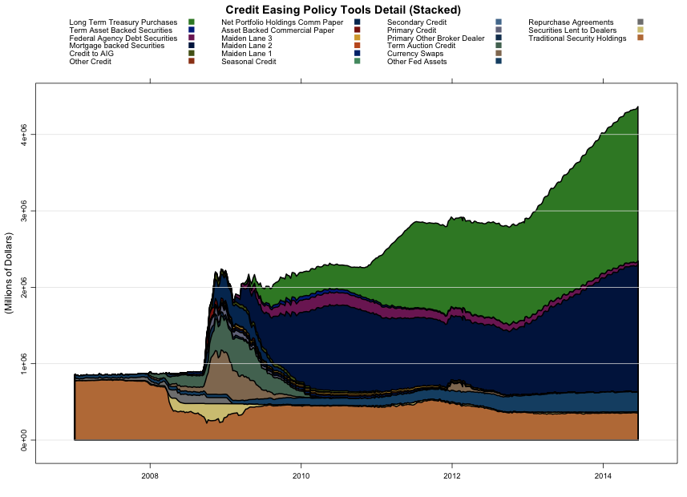

Lending to Financial Institutions
---------------------------------
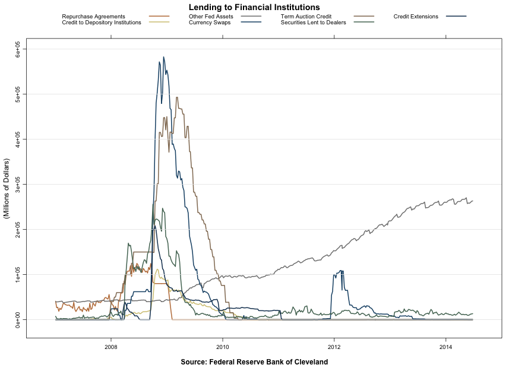
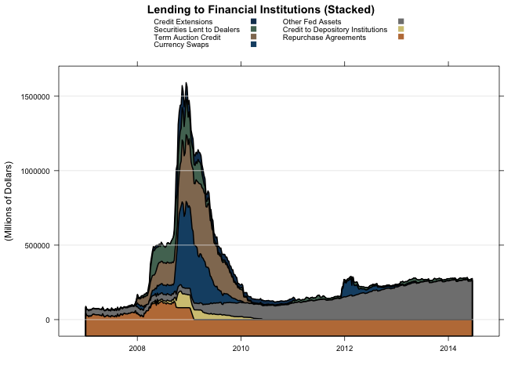

Credit to Depository Institutions
---------------------------------
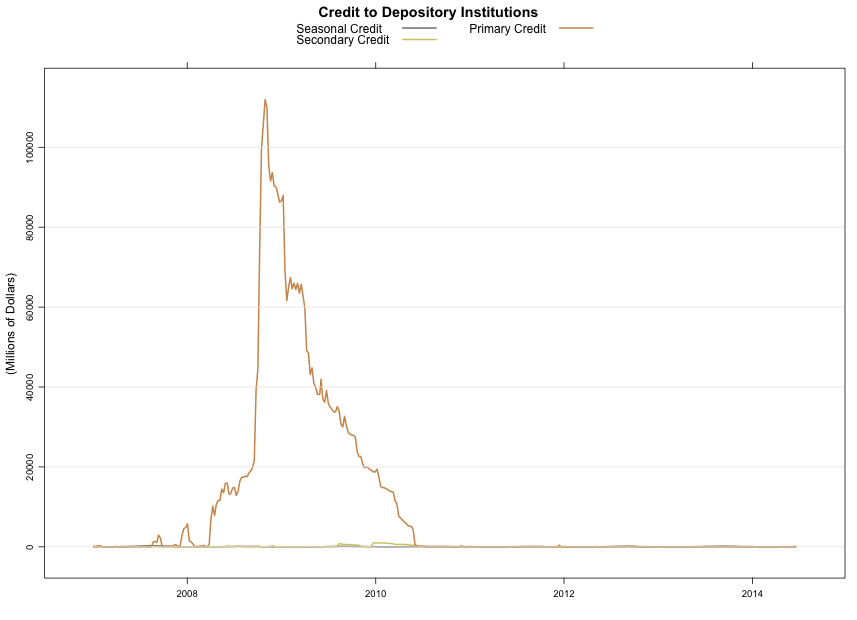
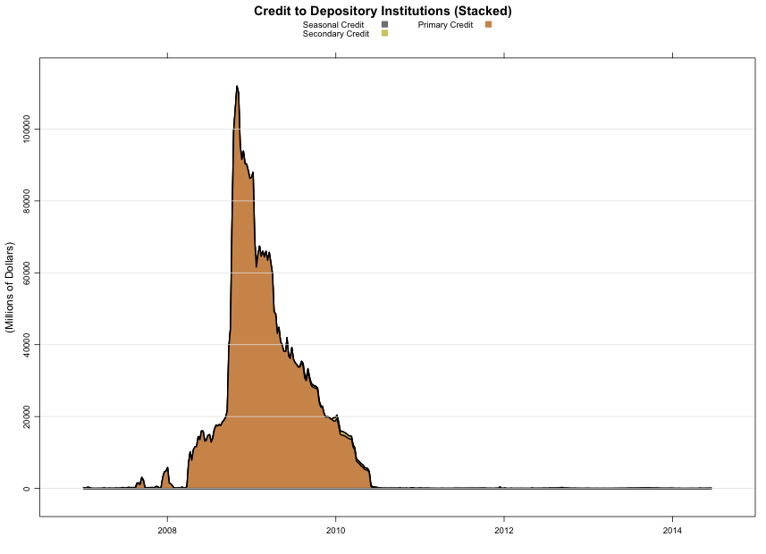

Credit Extensions to Financial Institutions
-------------------------------------------
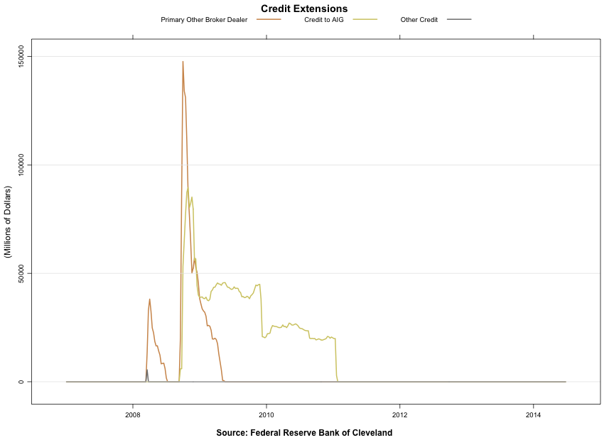
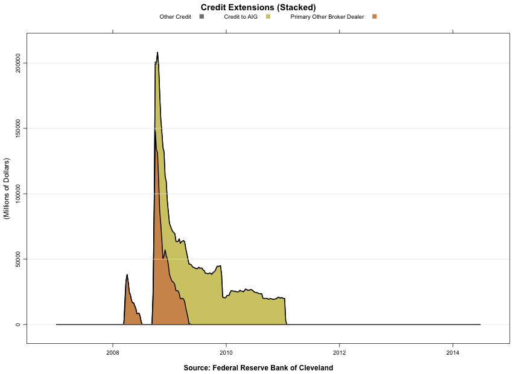

Providing Liquidity
-------------------
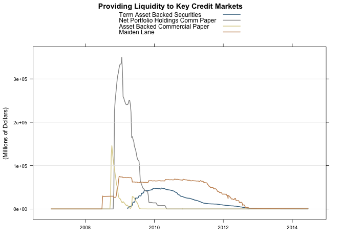
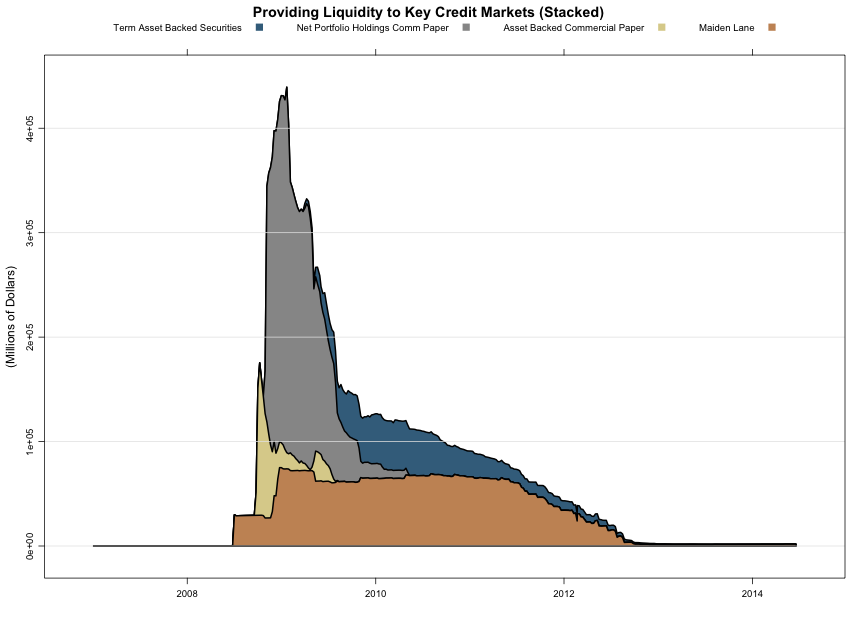

Maiden Lane
-----------
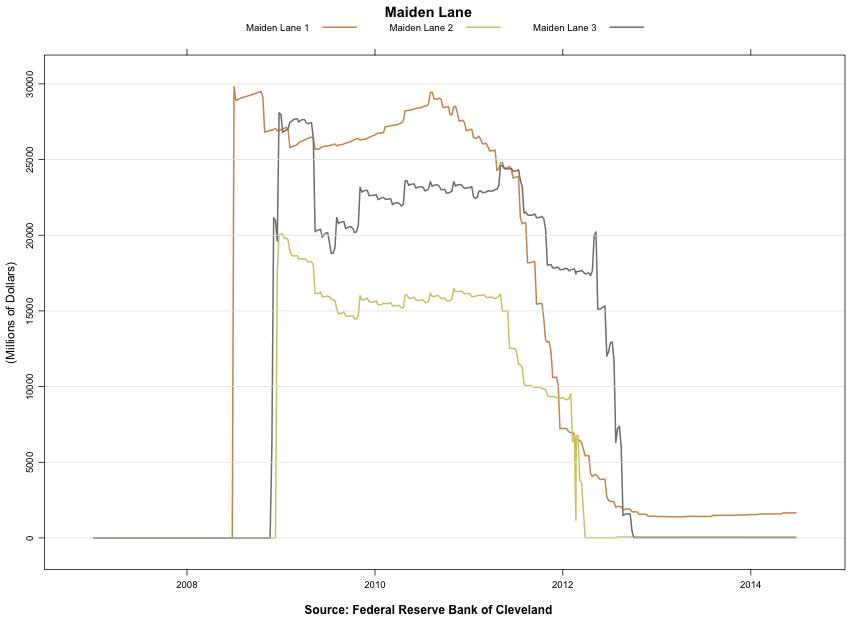
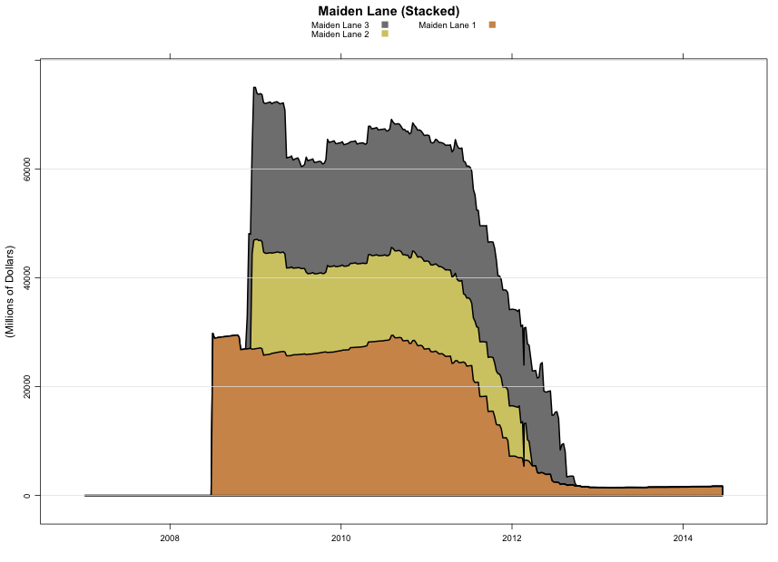

Traditional Security Holdings
-----------------------------
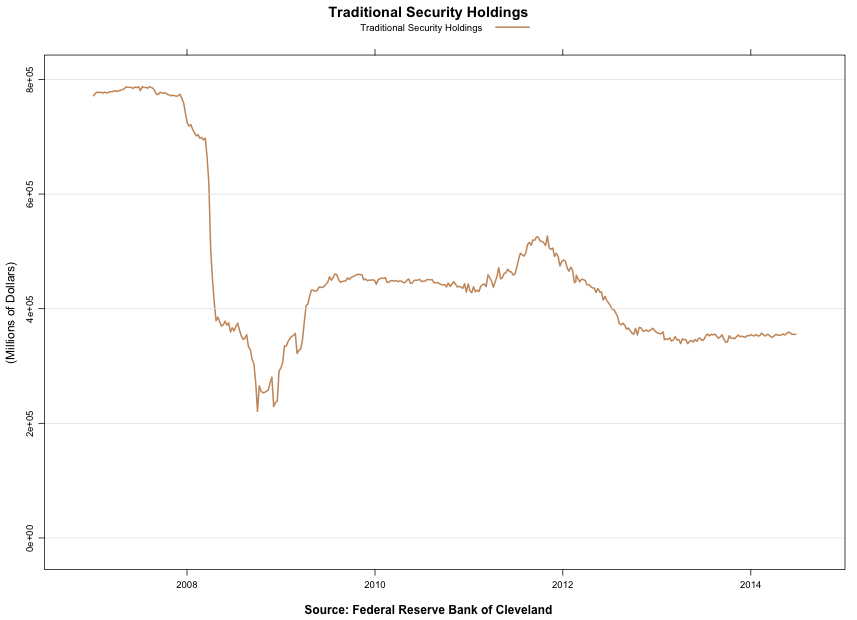
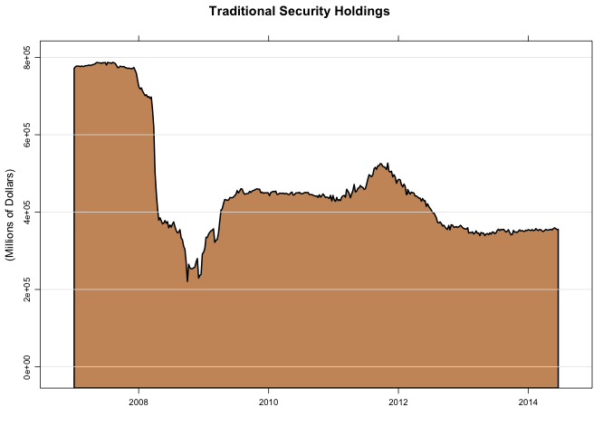

Federal Agency Debt and Mortgage-Backed Securities
--------------------------------------------------
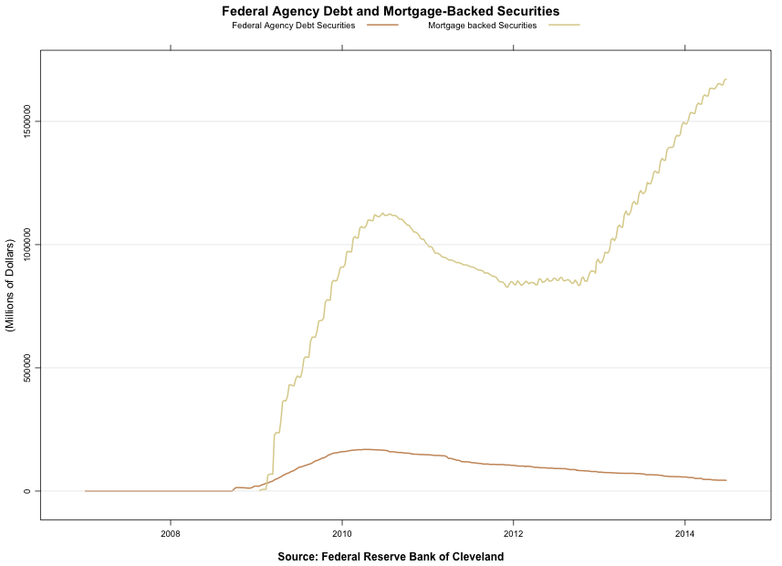
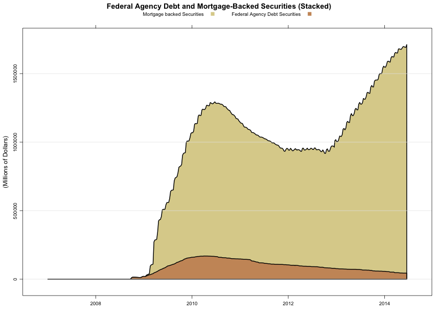

Long Term Treasury Purchases
----------------------------
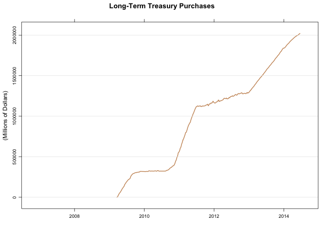
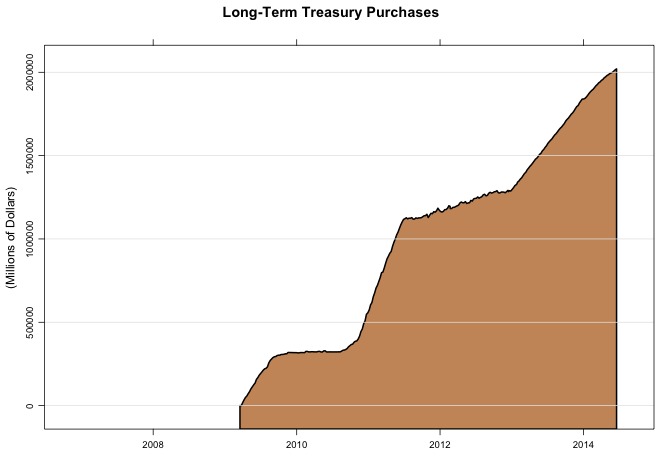

References
----------
* See [Cleveland FRB](http://www.clevelandfed.org/research/data/credit_easing/index.cfm) for more details.

